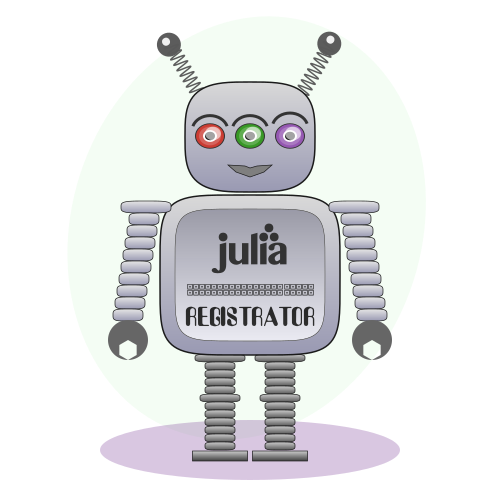

# Thank You for installing Registrator

Registrator is a GitHub app that automates creation of registration pull requests for your julia packages to the [General](https://github.com/JuliaRegistries/General) registry.

Contributions are welcome: [Registrator.jl](https://github.com/JuliaComputing/Registrator.jl)


